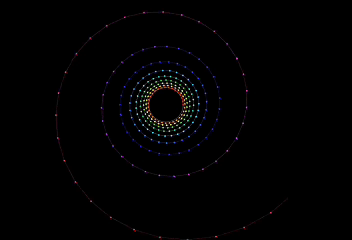
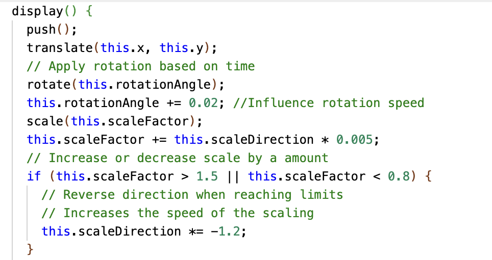
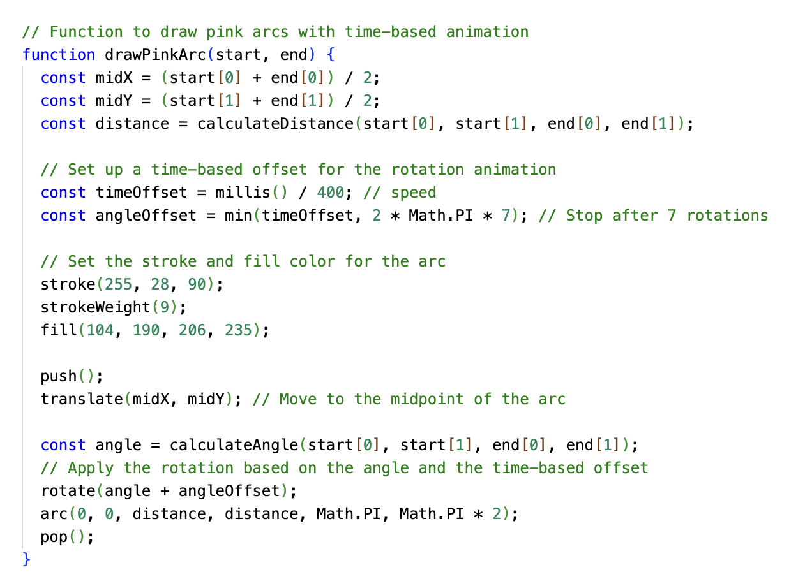

# XandraXu_xuxu0804

## __Instructions for Interacting with the Animation__
#### To experience the animation:
#### Load the page. The animation will start automatically.
#### Observe as the various circles animate with rotation, scaling, and unique path patterns.
#### After the animation stops, you can refresh the page to replay.

## __Individual Approach to Animation__
#### In this project, I chose a time-based approach for the animation. Without requiring user input, the animation consistently displays each time the page loads. My goal is to give the circular elements a unique animated effect while maintaining overall harmony.

## __Properties Animated & Unique Elements__
#### __1. Rotation and Scale:__ Each circle in DotCircle has a subtle rotation and scaling effect that changes over time. This rotation and scaling give the circles a rhythmic expansion and contraction, adding a breathing effect to the animation. The trailing effect remains, presenting a layered sense of depth.
#### __2. Direction Reversal:__ The code `this.scaleDirection *= -1.2`; reverses the scaling direction. This reversal adds impact, gradually increasing the scaling factor and resulting in an explosive effect.
#### __3. PinkArc Animation:__ PinkArc uses time-driven rotation and incremental angle control to generate a pink arc between a set of fixed points. It also rotates continuously for a dynamic visual effect.

## __References to Inspiration__
#### My inspiration comes from the Australian Aboriginal dot painting style, which uses layered dot patterns and rich colours to showcase the unique characteristics of primal art, full of vitality and storytelling, with a sense of movement.

#### I applied a similar structure of multi-layered concentric circles and varying dot patterns in my code. I animated the circles to create a dynamic, expanding effect, simulating this style's vibrant, layered quality. Towards the end of the animation, I made the circles enlarge dramatically, creating an “explosive” effect that symbolizes a burst of energy.
 
#### I also took inspiration from animated patterns and mandala shapes. The example of the GIF and circular animations helped influence the design and pace of my animations.

#### The rhythm in the animation and graphic design of the Fibonacci spiral usually arises from the orderly variation of elements such as points, lines, shapes, and colors. Its curve is natural and smooth, visually conveying a sense of outward expansion, which is similar to the periodic changes in the Pendulum Wave, both demonstrating the beauty of patterns found in natural and physical phenomena.

## __Technical of Animation Code__
#### In my code, the added animation brings rotation, scaling, and an "explosion" effect to the circles, making the overall visual more dynamic. Below is the technical explanation of the animation components in the code.
#### Rotation and Scaling of Circles:
#### 1. Each circle class has a `display()` method that defines its visual properties. In `DotCircle`, unique rotation and scaling animations are applied.
#### 2. Each `DotCircle` instance achieves rotation through the `rotationAngle` and scaling via the `scaleFactor`. The `scaleDirection` in the code controls the scaling direction, ensuring the circles reverse their scale when they reach the maximum or minimum size, making the circles appear to "breathe" as they expand and shrink.
#### 3. The scaling reverses each time by multiplying `scaleDirection` by -1.2, causing the scaling speed to accelerate with each iteration. This creates a final explosive visual effect.
 
#### PinkArc Animation:
#### 1. A fill color is added to the arc to create a semi-circular effect.
#### 2. A time-based rotation animation is generated, where `timeOffset` and `angleOffset` control the speed and direction of the arc's rotation, causing the arc to gradually rotate over time.
#### Each class uses `push()` and `pop()` to isolate transformations, allowing each circle to rotate and scale independently without affecting other elements on the canvas.
 

#### For this animation, I relied on standard p5.js functions, but I adapted some techniques from external examples:
#### The rotation and scaling techniques were refined based on p5.js animation tutorials I reviewed to better understand time-based transformations. The application of `scaleDirection` is based on the detailed definition of scale values in the video: [https://www.youtube.com/watch?v=pkHZTWOoTLM](https://www.youtube.com/watch?v=pkHZTWOoTLM).

