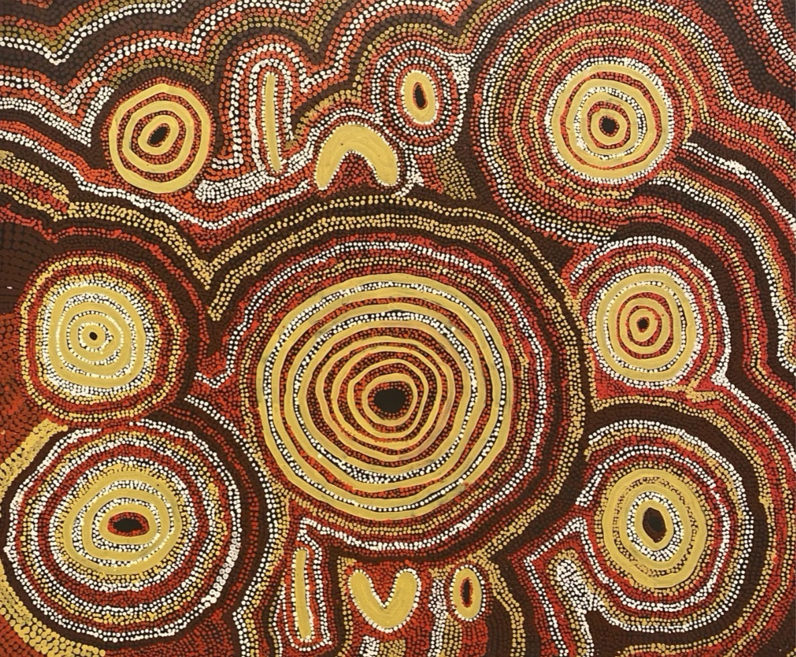

# XandraXu_xuxu0804

## __Instructions for Interacting with the Animation__
#### To experience the animation:
#### Load the page. The animation will start automatically.
#### Observe as the various circles animate with rotation, scaling, and unique path patterns.
#### After the animation stops, you can refresh the page to replay.

## __Individual Approach to Animation__
#### In this project, I chose a time-based approach for the animation. Without requiring user input, the animation consistently displays each time the page loads. My goal is to give the circular elements a unique animated effect while maintaining overall harmony.

## __Properties Animated & Unique Elements__
#### __1. Rotation and Scale:__ Each circle in DotCircle has a subtle rotation and scaling effect that changes over time. This rotation and scaling give the circles a rhythmic expansion and contraction, adding a breathing effect to the animation. The trailing effect remains, presenting a layered sense of depth.
#### __2. Direction Reversal:__ The code this.scaleDirection *= -1.2; reverses the scaling direction. This reversal adds impact, gradually increasing the scaling factor and resulting in an explosive effect.
#### __3. PinkArc Animation:__ PinkArc uses time-driven rotation and incremental angle control to generate a pink arc between a set of fixed points. It also rotates continuously for a dynamic visual effect.

## __References to Inspiration__
#### My inspiration comes from the Australian Aboriginal dot painting style, which uses layered dot patterns and rich colours to showcase the unique characteristics of primal art, full of vitality and storytelling, with a sense of movement.

